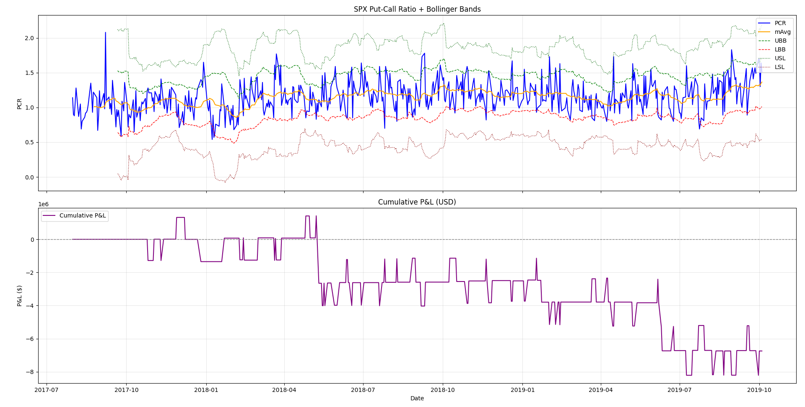

# SPX Put-Call Ratio Bollinger Band Strategy

> 利用 **SPX Put-Call Ratio（PCR）** 搭配**布林通道**進行 S&P 500 期貨的逆向交易回測

---

## 📌 策略說明

這是一個**逆向操作（Contrarian）**策略，核心邏輯：

> 當市場情緒極端時，反向操作。

| 市場情緒 | PCR 表現 | 策略動作 |
|---|---|---|
| 極度恐慌（大量買 Put） | PCR 突破上布林通道（UBB） | **買進**期貨（預期反彈） |
| 過度樂觀（大量買 Call） | PCR 跌破下布林通道（LBB） | **賣出**期貨（預期回落） |
| 情緒回歸正常 | PCR 回到均線（mAvg） | **平倉出場** |
| 情緒持續極端 | PCR 突破停損線（USL / LSL） | **強制停損** |

---

## 📊 指標說明

| 指標 | 說明 |
|---|---|
| `mAvg` | PCR 的 20 日移動平均（情緒基準線） |
| `UBB` | 上布林通道：mAvg + 1.5σ |
| `LBB` | 下布林通道：mAvg - 1.5σ |
| `USL` | 上停損線：UBB + 2σ |
| `LSL` | 下停損線：LBB - 2σ |

---

## 🗂️ 資料來源

| 資料 | 來源 |
|---|---|
| S&P 500 期貨價格 | [Yahoo Finance](https://finance.yahoo.com/)（代碼：`ES=F`） |
| SPX Put-Call Ratio（舊檔 2003~2012） | [CBOE 官方](https://cdn.cboe.com/resources/options/volume_and_call_put_ratios/indexpcarchive.csv) |
| SPX Put-Call Ratio（新檔 2012~今） | [CBOE 官方](https://cdn.cboe.com/resources/options/volume_and_call_put_ratios/indexpc.csv) |

全部為**免費公開資料**，無需申請 API Key。

---

## ⚙️ 參數設定

| 參數 | 預設值 | 說明 |
|---|---|---|
| `sma` | 20 | 移動平均視窗長度 |
| `k` | 1.5 | 布林通道寬度（k 倍標準差） |
| `l` | 2 | 停損帶寬度（從布林通道往外 l 倍） |
| `abs_SL` | 25 | 絕對停損點數 |

---

## 🚀 安裝與執行

### 1. 安裝套件

```bash
pip install yfinance pandas matplotlib openpyxl
```

### 2. 執行策略

```bash
python PCR_Bollinger_Strategy.py
```

### 3. 輸出結果

| 檔案 | 說明 |
|---|---|
| `PCR_SL_output.xlsx` | 每日交易明細（買賣方向、損益、累計資金） |
| `PCR_strategy_chart.png` | PCR 布林通道圖 + 累計損益曲線圖 |

---

## 📈 圖表範例

程式執行後會產生兩張圖：

**上圖：SPX Put-Call Ratio + 布林通道**
- 藍線：每日 PCR 值
- 橘線：20 日均線
- 綠虛線 / 紅虛線：布林上下通道（進場基準）
- 綠點線 / 紅點線：停損上下線

**下圖：累計損益曲線（USD）**
- 紫色折線追蹤每筆交易後的累計盈虧變化




---

## ⚠️ 免責聲明

本程式僅供**學術研究與學習用途**，不構成任何投資建議。
實際交易涉及市場風險，請自行評估。

---

## 🙏 參考資料

- [CBOE Options Data](https://www.cboe.com/us/options/market_statistics/)
- Original Python strategy inspired by quantitative trading open-source community
